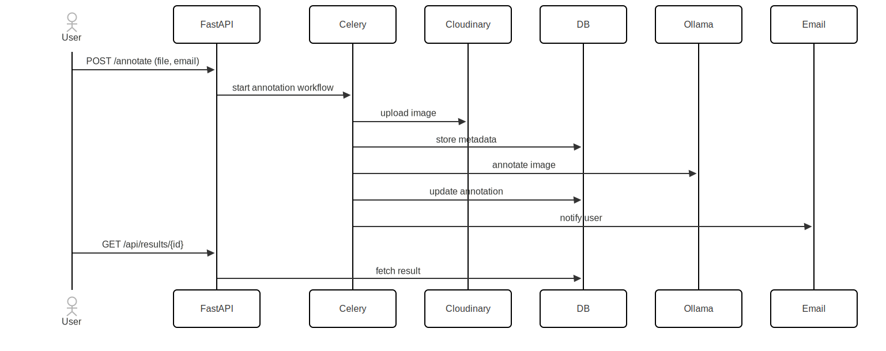

# PIPELINE


## 1. Project Overview

**PIPELINE** is an image annotation service that leverages **FastAPI** as a modern, async REST API backend and **Celery** for robust background task processing. Its primary goal is to allow users to upload images, automatically annotate them using advanced vision-language models (e.g., moondream:v2 via Ollama), and retrieve the results efficiently, with notification support via email.

- **FastAPI** powers the synchronous and asynchronous REST endpoints, serving both HTML pages and API responses.
- **Celery** manages long-running or resource-intensive tasks (such as image uploads, annotation, and notifications) using a distributed task queue backed by Redis.
- The system is designed for extensibility, ease of deployment (with Docker/Docker Compose), and developer friendliness.

## 2. Tech Stack

- **FastAPI** – Web API framework
- **Celery** – Distributed task queue for background jobs
- **Redis** – Broker for Celery and caching
- **PostgreSQL** – Primary database
- **SQLModel/SQLAlchemy** – ORM for database models
- **Cloudinary** – Media storage for uploaded images
- **Ollama** – Vision-language model integration (LangChain)
- **Docker** / **Docker Compose** – Deployment and service orchestration
- **Jinja2** – HTML templating
- **Emails** – For sending annotation result notifications

## 3. Installation & Setup

### Prerequisites

- Python >= 3.12
- Docker & Docker Compose (recommended for local development)
- Make sure your machine has sufficient RAM, especially for running Ollama models.

### Environment Setup

1. **Clone the repository:**
   ```bash
   git clone https://github.com/al-chris/PIPELINE.git
   cd PIPELINE
   ```

2. **Create a `.env` file:**
   Copy `.env.example` to `.env` and fill in your secrets (Postgres, Redis, Cloudinary, Ollama, etc.).

3. **Start all services with Docker Compose:**
   ```bash
   docker-compose up --build
   ```

   This will launch:
   - FastAPI backend (`localhost:8000`)
   - Celery worker
   - Redis (and Redis Commander UI at `localhost:8081`)
   - PostgreSQL

4. **(Optional) Manual Setup**
   If you prefer, set up a Python virtual environment and install dependencies:
   ```bash
   python -m venv venv
   source venv/bin/activate
   pip install -e .
   ```

5. **Database Initialization:**
   The database tables are automatically created on FastAPI startup.

### Required Environment Variables

See `.env.example` for all options. Key variables:
- `DATABASE_URL`
- `REDIS_URL`
- `CLOUDINARY_*`
- `OLLAMA_BASE_URL`
- `FRONTEND_HOST`
- `POSTGRES_USER`, `POSTGRES_PASSWORD`, `POSTGRES_DB`, etc.

## 4. Usage Guide

### Running the FastAPI Server

- **With Docker Compose:**  
  The backend is accessible at [http://localhost:8000](http://localhost:8000)
- **Manual:**  
  ```bash
  uvicorn app.main:app --reload
  ```

### Starting Celery Worker

- **With Docker Compose:**  
  The worker starts automatically.
- **Manual:**  
  ```bash
  celery -A app.tasks.celery worker --loglevel=info
  ```

### API Endpoints

#### Annotate Image

- `POST /annotate`
  - Body: `file` (UploadFile), `email` (string)
  - Response: `{ "message": "Annotation in progress", "id": "<task_id>" }`

#### Get Annotation Result

- `GET /api/results/{id}`
  - Response: `{ "annotation": "...", "file_url": "..." }` if found

#### Web Interface

- `GET /`
  - Upload page (HTML)

- `GET /results/{id}`
  - Results page (HTML)

### Example Workflow

1. User uploads an image via the web or API.
2. FastAPI triggers the Celery task chain:
   - Upload to Cloudinary
   - Commit DB record
   - Call LLM for annotation (via Ollama)
   - Update DB with result
   - Send notification email
3. User retrieves annotation via API or web.

## 5. Project Structure

```
PIPELINE/
├── app/
│   ├── main.py           # FastAPI entrypoint & routes
│   ├── tasks.py          # Celery tasks and workflow logic
│   ├── db.py             # Database models and initialization
│   ├── file.py           # File handling (Cloudinary integration)
│   ├── email.py          # Email utilities
│   ├── config.py         # Configuration and settings
│   ├── logging.py        # Logging setup
│   ├── static/           # Static assets (CSS, JS, images)
│   └── templates/        # Jinja2 HTML templates
├── docker-compose.yml    # Multi-service orchestration
├── dockerfile            # Backend image definition
├── pyproject.toml        # Python package metadata
├── uv.lock               # Dependency lockfile
└── .env.example          # Example environment variables
```

## 6. Architecture & Workflow

- **User** uploads an image via the frontend or API.
- **FastAPI** receives the request and triggers a Celery workflow.
- **Celery** tasks:
  1. Upload image to Cloudinary.
  2. Store metadata in PostgreSQL.
  3. Invoke Ollama model for annotation.
  4. Update DB with results.
  5. Send email notification (with result link).
- **Redis** is used for Celery's broker and backend.
- **PostgreSQL** stores file and annotation records.
- **Cloudinary** is the media storage backend.

## 7. UML Diagrams


### Class Diagram (Key Classes)



### Sequence Diagram (Request Flow)



### Deployment Diagram



## 8. Contributing

We welcome contributions!

- **Fork** the repo and create your feature branch (`git checkout -b feature/my-feature`)
- **Commit** your changes (`git commit -am 'Add new feature'`)
- **Push** to the branch (`git push origin feature/my-feature`)
- **Open a Pull Request**

### Coding Standards

- Use [PEP8](https://www.python.org/dev/peps/pep-0008/) compliant code.
- Add docstrings and type annotations.
- Maintain clear commit history.

### Branching

- Use `main` for stable releases.
- Use feature branches (`feature/`, `bugfix/`, etc.) for development.

### Issues

- Use GitHub Issues for bug reports and feature requests.

## 9. License & Credits

- **License:** MIT (see `LICENSE` file)
- **Third-party libraries:**  
  FastAPI, Celery, Redis, PostgreSQL, SQLModel, Cloudinary, LangChain, Ollama, and others (see `pyproject.toml`).
- **Credits:**  
  Contributions by [al-chris](https://github.com/al-chris).

---